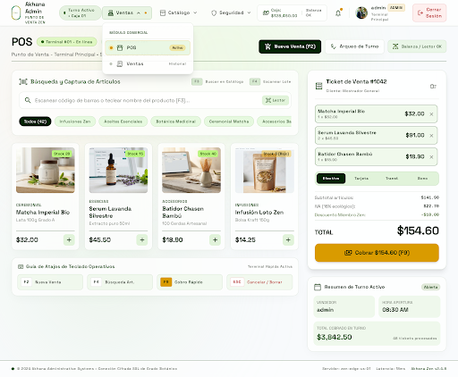

# Especificación de Diseño UI/UX - REQ-0005: Menú de Navegación Principal

## 🎨 1. Concepto y Filosofía Visual

La interfaz de navegación superior adopta la filosofía **Corporate Organic Glassmorphism** de **Akhana**, garantizando una experiencia de escritorio compacta, eficiente, panorámica y elegante, con **ausencia deliberada de sidebars laterales** para maximizar el área de trabajo operativo.

### Prototipo Generado en Stitch MCP
- **Proyecto:** `Akhana Admin POS` (`projects/6337866383860141104`)
- **Pantalla:** `Akhana Admin POS - Navegación Superior` (`projects/6337866383860141104/screens/02b0e94e07514a0486c611e5095313b9`)
- **Captura:**
  

---

## 📐 2. Tokens de Color y Superficies

- **Canvas Principal:** `#F8FAFC` con sutiles gradientes radiales de luz botánica (`rgba(123, 177, 66, 0.04)`).
- **Navbar Superior (Contenedor Maestro):**
  - Altura: `68px` - `72px` compacto.
  - Fondo: `rgba(255, 255, 255, 0.85)` con `backdrop-filter: blur(16px)`.
  - Borde Inferior: `1px solid rgba(46, 91, 39, 0.10)`.
  - Sombra sutil: `0 8px 24px -6px rgba(27, 59, 24, 0.04)`.
- **Identidad de Marca (Izquierda):**
  - Logo oficial de Akhana (círculo dorado zen con hoja botánica verde).
  - Título: `Akhana Admin` en Space Grotesk / Verde bosque profundo (`#1B3B18`), subtítulo `PUNTO DE VENTA ZEN` en `10px` tracking amplio.
- **Grupos del Menú (Centro):**
  - Botón de Grupo: Píldora de interacción con icono sutil, etiqueta en Space Grotesk (`14px`, peso 600) y chevron animado (`▾`).
  - Color inactivo: `#4A5568` o `#334155`. En hover: `#1B3B18` con fondo `rgba(46, 91, 39, 0.06)`.
  - **Grupo Activo (ej. Ventas):** Fondo píldora `rgba(46, 91, 39, 0.10)`, texto `#1B3B18`, micro-punto indicador en Verde Hoja (`#7BB142`) o Dorado Zen (`#F5B800`).
- **Menú Desplegable Flotante (Dropdown on Hover):**
  - Posicionamiento: `position: absolute; top: calc(100% + 6px); left: 0; min-width: 220px;`.
  - Fondo: `rgba(255, 255, 255, 0.95)` con `backdrop-filter: blur(20px)`.
  - Borde: `1px solid rgba(46, 91, 39, 0.12)`.
  - Esquinas: `12px` (round-md/lg).
  - Sombra: `0 16px 36px -8px rgba(27, 59, 24, 0.12)`.
  - Header de grupo dentro del desplegable: Texto en mayúsculas `MÓDULO COMERCIAL`, `MÓDULO CATÁLOGO`, `MÓDULO SEGURIDAD` en `10px` con tracking (`0.06em`) y color `#718096`.
  - **Item de Opción:** Enlace horizontal con icono, texto principal y badge o micro-indicador:
    - Estado normal: Padding `10px 14px`, esquinas `8px`, texto `#2D3748`.
    - Estado hover: Fondo `rgba(46, 91, 39, 0.05)`, texto `#1B3B18`.
    - Estado activo (ej. `POS` cuando la ruta es `/pos`): Fondo suave con acento zen `rgba(245, 184, 0, 0.15)`, punto dorado `#F5B800` y badge estilizado `Activo` en Dorado Zen.
- **Área de Usuario y Sesión (Derecha):**
  - Indicador de estado de terminal / turno (`Caja: $128,450.00`, `Balanza: OK` o indicador `Terminal En Línea`).
  - Avatar circular del usuario con inicial y nombre `admin`.
  - Insignia de rol en píldora (`ADMIN` en `#F5B800` o `#2E5B27`).
  - Botón de cierre de sesión: `Cerrar Sesión` con icono de puerta/logout, fondo transparente o rosa botánico tenue (`rgba(186, 26, 26, 0.06)`), texto `#BA1A1A` y borde suave.

---

## 📐 3. Área de Contenido Principal (Section Shell)

Debajo de la barra de navegación:
- **Encabezado de Sección:**
  - Título `<h1>`: Título de la sección en Space Grotesk (`32px` - `36px`, negrita, `#1B3B18`).
  - Badge de estado: Píldora verde `En línea` o identificador de ruta.
  - Subtítulo descriptivo de la sección activa.
- **Tarjeta de Estado Base:**
  - Contenedor con borde orgánico translúcido y fondo blanco puro al 80% de opacidad.
  - Mensaje informativo claro de que la estructura base de navegación se encuentra operando y lista para alojar los módulos de negocio posteriores.
